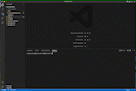

# README-write []
  
  ## Description
  This application, run in Node.js, is meant to quicly and easily generate a professional README.md file through a series of terminal prompts. This application uses the following technologies: 
  - Node.js 
  - Inquirer 
  - Arrow functions
  - Template literals 
  
  This application allows users to create consistent and professional README.md files to better illustrate your application's function and usage. This README.md was actually generated using the application itself. 
  
  ## Table of Contents
   - [Installation](#installation)
   - [Usage](#usage)
   - [Contribution](#contribution)
   - [Testing](#test)
   - [License](#license)
   - [Questions](#questions)

  ## Installation
  To install dependencies and run this application, please pass the following code in the command line of the application:

  ~~~
  npm i inquirer@8.2.4
  ~~~

  ## Usage
  This application is meant to be used in the terminal and does not have a deployed version. 

  

  ## Contribution
  NA

  ## Testing
  To test, please pass the following code in the command line of the application:

  ~~~
  NA
  ~~~

  ## License
  
  This project uses the MIT license.

  ## Questions
  If you have any questions, please visit my GitHub or email me:
  - GitHub profile: https://github.com/ecussler
  - Email: cusslere@gmail.com
  